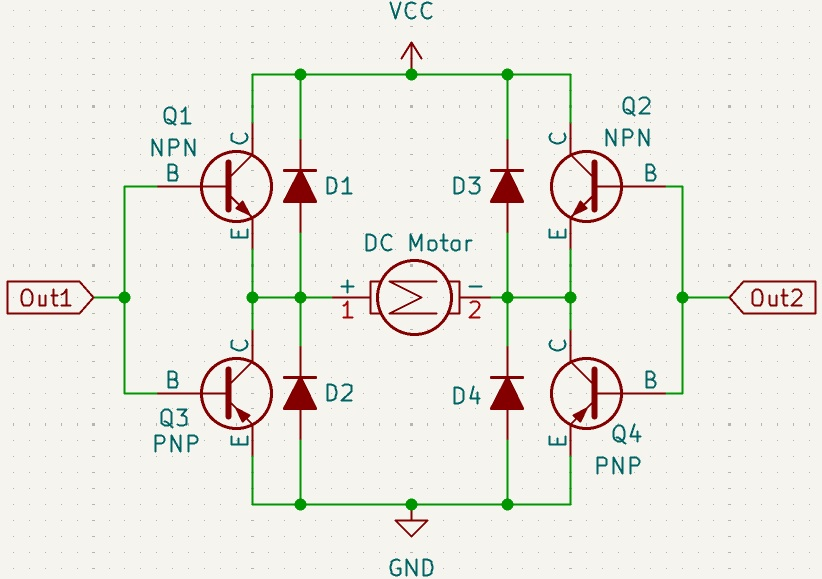
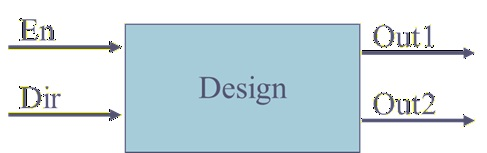

<!---

This file is used to generate your project datasheet. Please fill in the information below and delete any unused
sections.

You can also include images in this folder and reference them in the markdown. Each image must be less than
512 kb in size, and the combined size of all images must be less than 1 MB.
-->

## How it works

This logic circuit controls the H-bridge for a DC motor shown in the figure below. 

 

 

The logical system below has a Dir signal input to control the motor direction of rotation. The En digital input is used to shut down or turn on the motor; this pin can also be used as a PWM signal to control velocity.
 

 
 

 

## How to test

The En signal: set to 1, the Motor is on; set to 0, the motor is OFF.
The direction of rotation is controlled by the Dir logical signal: 0, clockwise rotation; 1, inverse clockwise rotation, but this depends on how you have wired your motor.

## External hardware

DC Motor, 4 Transistors, and 4 diodes selected depending on motor size and supported current.
